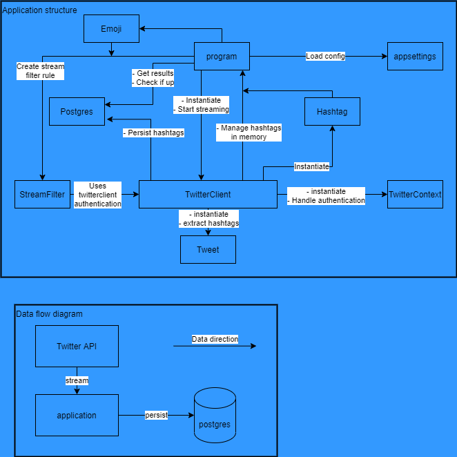

# Twitter happy hashtags

The solution streams tweets and determine what are the happiest hashtags being posted every hour.

Design available in the included .drawio file. Editable in vs code with hediet.vscode-drawio extension.

## Design overview


## Getting Started
The solution can run:
- using docker-compose
- bringing up containers separately
- bringing up postgres container; running dotnet on localhost

### Dependencies

* docker-compose
* dotnet
* Twitter app identity

> Initial setup requires a twitter application identity with access to the v2 streaming endpoints. Register here [dev.twitter](https://developer.twitter.com/en), create an application and copy the API key & secret.

### Install for docker-compose:
* Set the Application Settings (See below) in appsettings.json
* Set the environment variables in .env
* Install Docker-Compose
``` bash
# docker-compose
curl -L "https://github.com/docker/compose/releases/download/1.23.1/docker-compose-$(uname -s)-$(uname -m)" -o /usr/local/bin/docker-compose
chmod +x /usr/local/bin/docker-compose
```

### Install for dotnet:
* The database container needs to be brought up separately. This can be done with docker.
``` bash
docker run --name twitter-db -e POSTGRES_PASSWORD=mysecretpassword -d postgres -p 5432:5432
```
* Install the dotnet sdk:
``` bash
# download dotnet 5 sdk
wget https://packages.microsoft.com/config/debian/10/packages-microsoft-prod.deb -O packages-microsoft-prod.deb
dpkg -i packages-microsoft-prod.deb

apt-get update; \
  apt-get install -y apt-transport-https && \
  apt-get update && \
  apt-get install -y dotnet-sdk-5.0
```
* Set the Application Settings (See below) in appsettings.json

### Application Settings
    * Set twitter api key as *twitterKey*
    * Set twitter api secret as *twitterSecret*
    * Create a password for the postgres database user:
        * Set the password in the *postgres* Connection String
        * Set the same password as *postgresPassword* in .env file
    * Set the *StreamLimit* to the limit of tweets to stream

> The StreamLimit property can help to prevent burning through the monthly Twitter Tweet cap. It will cause streaming to stop when the limit is reached. Leave it at 0 to continue streaming indefinitely.

> The connection string runs with default username and database settings as Postgres. The Host/Server property changes depending on the environment. When running as docker container, you can expose the 5432 port on the localhost. When running with docker-compose the application can reach it with the name of the docker-compose component. For this solution it is set to *db*.


### Executing program

#### dotnet
In solution/client directory, build the solution, then run.
``` bash
dotnet build
dotnet run
```

#### docker-compose
``` bash
docker-compose build
docker-compose up # run attached
docker-compose up -d # run detached
```
When changes are made, re-build with dotnet build, or docker-compose build.

### Checking results
Results can be viewed in two ways:
1. View periodic top results in app logs
2. Connect to the database container and query the database

### App logs
* When running directly as `dotnet run`, the top results should be visisble in the console.
* When running as container, use docker-compose up to view the container logs. Alternatively, run detached and view logs using the docker-compose utility.
``` bash
docker-compose up # Console logs available
docker-compose up -d # Logs available by below command
docker-compose logs # Access logs of the detached running docker-compose solution
``` 

### Query the database
* Connect to the running database container
``` bash
# When running with docker
docker exec -it {CONTAINER ID} bash # replace with container id, find with docker ps
# When running with docker-compose
docker-compose exec db bash
su postgres # Switch to the postgres user
psql # Start the postgres sql CLI
SELECT * FROM twitter.happy_hashtags ORDER BY happiness desc;
```
